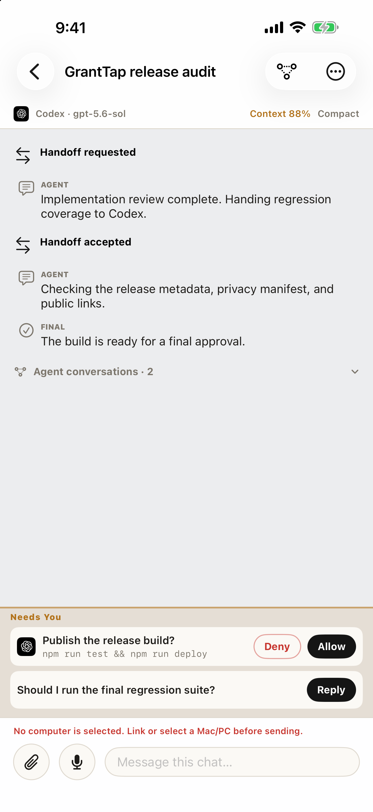
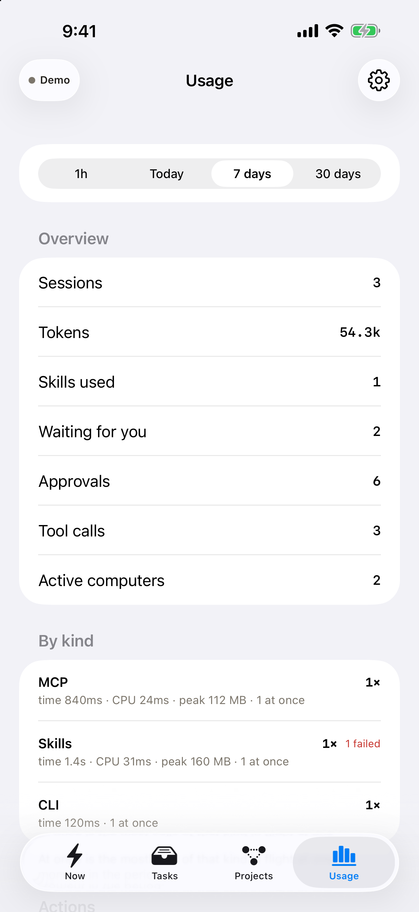

# GrantTap Personal website

GrantTap is a Personal live control center for local coding agents:

> See what your coding agents are doing. Step in when they need you.

The public site presents one product for iPhone and Apple Watch across Claude
Code, Codex, Cursor Beta, and Grok Build where its implemented behavior is
available. The site presents one Personal product.

Project Mesh coordinates those existing agents with bounded encrypted task
state, dependencies, resource claims, agent-to-agent questions, and same-task
handoffs across computers. Project Governance decides, per Project, which
skills, MCP servers, and shell access agents may use, and every linked computer
applies the same policy. It does not copy hidden reasoning or turn GrantTap
into a coding agent or an unrestricted orchestrator.

## Install

```bash
# Codex plugin
codex plugin marketplace add sergii-ziborov/granttap-mcp
codex plugin add granttap@granttap

# Claude Code plugin
claude plugin marketplace add sergii-ziborov/granttap-mcp
claude plugin install granttap@granttap

# Background helper and provider hooks
npm install -g granttap-mcp
granttap setup
```

After plugin installation, run `granttap setup` and Authenticate in the coding
app. The browser opens [granttap.com/connect](https://granttap.com/connect):
this computer, its phones, Approve, Reconnect, and Add another. A saved pairing
does not skip that page or jump to the coding-app callback. Scan in the
GrantTap app only when a new device joins. Do not ask an agent to print a
pairing QR in chat. The current plugin uses the public `granttap-mcp@0.8.18`
package.

Live `/` is the Cloudflare Next site (`npm run deploy:cloudflare`). Live
`/connect` and `/api/connect` stay on the Hetzner helper (`hetzner/`), because
that page talks to the local GrantTap helper for the pairing QR.

For Cursor, install the reviewed **GrantTap** Marketplace listing, then
`granttap setup`. Do not add GrantTap in Customize → MCPs.

The Task screenshot includes a demo Runtime history. On a real computer,
Invocation history requires the separately distributed GrantTap Engine. A tool
request or reported success is not presented as a verified filesystem change;
the bridge does not yet produce verified change events or revision-bound impact
links.

- [granttap-mcp source](https://github.com/sergii-ziborov/granttap-mcp)
- [npm package](https://www.npmjs.com/package/granttap-mcp)
- [ciphertext relay source](https://github.com/sergii-ziborov/granttap-relay)

## Public customer pages

- [Pricing](https://granttap.com/pricing)
- [Privacy](https://granttap.com/privacy)
- [Terms](https://granttap.com/terms)
- [Support](https://granttap.com/support)
- [Security](https://granttap.com/security)
- [Data choices](https://granttap.com/data-rights)
- [Accessibility](https://granttap.com/accessibility)
- [Licenses](https://granttap.com/licenses)

## Development

Node.js 22.13 or newer is required.

```bash
npm install
npm run typecheck
npm test
npm run lint
```

Live granttap.com is the Hetzner compose stack: `/` on port 3211, `/connect`
and `/api/connect` on port 3210. `wrangler.production.jsonc` is a leftover
Cloudflare config — do not `wrangler deploy` it over the live domain. Publish
by rsyncing this tree to `/srv/apps/granttap-site/releases/` and
`docker compose -p granttap-web -f compose.hetzner.yaml up -d --build`.

Product captures under `public/product/` must come from deterministic sample
data and contain no real pairing, task, repository, credential, or audit data.

## Current captures

<p align="center">
  
  
  
</p>
