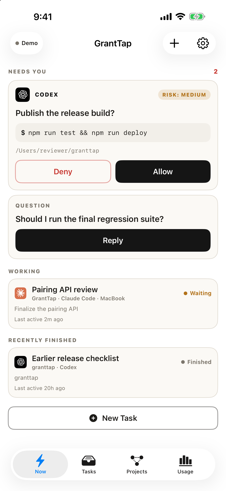
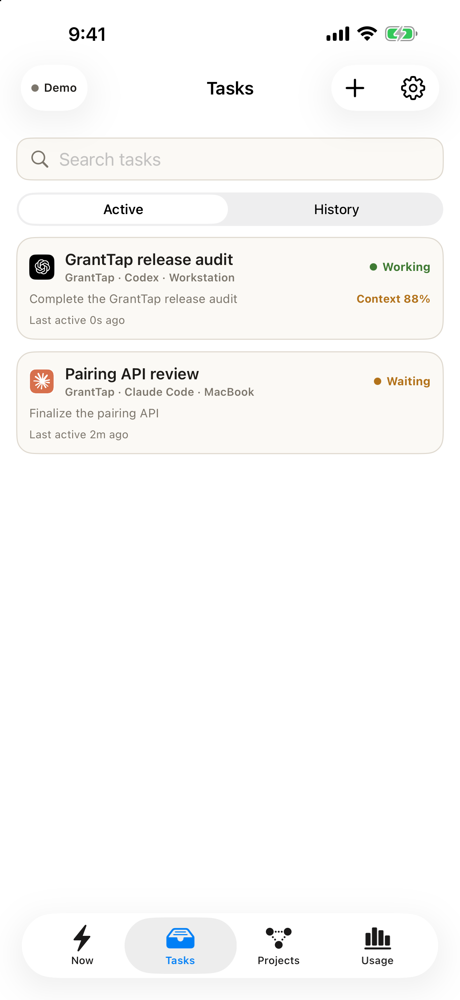

# GrantTap

**Step away from your Mac. Keep Cursor, Claude, Codex, Copilot, and Grok moving.**

GrantTap is the secure iPhone and Apple Watch companion for coding-agent
sessions already running on your computer. Approve a shell command, answer a
question, open chat, inspect the latest task activity, or send the next turn
without starting a second agent or moving your project to another service.

<p align="center">
  
  
  
</p>

The product site is live at [granttap.com](https://granttap.com). The iPhone
and Apple Watch apps are still being prepared for App Store review. The planned
Personal subscription includes a 7-day free trial, then costs $2.99 per month
for up to three linked computers. A direct same-Wi-Fi transport without server
synchronization is planned, but is not available yet.

## One task, wherever you are

1. Cursor, Claude Code, Codex, Copilot, or Grok Build keeps working in its normal local session.
2. When it needs a decision, GrantTap sends the encrypted event to your paired
   devices.
3. You approve, deny, reply by voice or text, or open the task for more context.
4. The response returns to the same local session.

On iPhone, each task exposes recent visible activity, full formatted chat,
attachments, agent access, context-window usage, Codex compaction, and allowed
MCP servers or project skills. Cursor shell approvals and Copilot session chat
share the same phone remote. Apple Watch keeps the fast path focused: active
and recent tasks, recent updates, voice replies, and approvals.

## Security boundary

GrantTap is a thin encrypted control channel, not a model proxy.

- Projects, model credentials, and model traffic remain on the computer.
- Pairing and task traffic are end-to-end encrypted.
- Each attached task has an independent key.
- The relay routes ciphertext and cannot decrypt task content.
- A device with access to one task cannot use that key to open another task.

See [SECURITY.md](SECURITY.md) for the exact boundary and relay-visible
metadata.

## Install once, then add agents

```bash
npm install -g granttap-mcp
granttap connect
granttap setup

# GrantTap plugin for Codex
codex plugin marketplace add sergii-ziborov/granttap
codex plugin add granttap@personal
```

One machine helper owns one encrypted phone pairing. `granttap setup` adds or
repairs all detected supported agent adapters, so installing another agent does
not create a second GrantTap account or pairing. Connect/reconnect reuses a
healthy pairing; replacement is an explicit unlink-and-pair-again action.
Provider authentication and model credentials remain separate.

- [granttap-mcp on npm](https://www.npmjs.com/package/granttap-mcp)
- [MCP bridge source](https://github.com/sergii-ziborov/granttap-mcp)
- [Relay source](https://github.com/sergii-ziborov/granttap-relay)

## App Store and customer URLs

The website publishes the customer-facing pages needed for review and ongoing
support. Keep these URLs stable across releases:

- [Support](https://granttap.com/support)
- [Privacy Policy](https://granttap.com/privacy)
- [Data choices and deletion](https://granttap.com/data-rights)
- [Security](https://granttap.com/security)
- [Accessibility](https://granttap.com/accessibility)
- [Terms of Use](https://granttap.com/terms)
- [Licenses](https://granttap.com/licenses)

The site contains only customer-facing support and policy material. Never put
an owner placeholder, internal submission checklist, or unpublished roadmap on
a public page or in this repository.

## Develop the website

Node.js 22.13 or newer is required.

```bash
git clone https://github.com/sergii-ziborov/granttap-site.git
cd granttap-site
npm install
npm run dev
```

Validate a production build with:

```bash
npm test
npm run lint
```

The site uses React, vinext, and Cloudflare's Vite tooling. Production is
configured in `wrangler.production.jsonc`; `granttap.com` is the canonical
origin and `www` redirects permanently to it.

## Product-capture contract

The website and this README use captures from current test builds. The security
visual is a separate deterministic local render, clearly labelled in the image,
so it can demonstrate the documented controls without exposing a pairing code,
task, repository path, credential, or audit record. Keep a single language and
matching time across each capture set.

| Asset | Pixels | Contents |
| --- | ---: | --- |
| `public/product/iphone-command-center.png` | 1206 × 2622 | Codex task list, approvals, and composer |
| `public/product/iphone-claude-tasks.png` | 1206 × 2622 | Claude Code task list, scheduler, and composer |
| *(planned)* Cursor / Copilot home | 1206 × 2622 | Capture when English demo UI shows agent tabs |
| `public/product/iphone-task-detail.png` | 1206 × 2622 | Recent activity, usage, and context |
| `public/product/iphone-mcp-usage.png` | 1206 × 2622 | Observed MCP and skill usage |
| `public/product/iphone-chat.png` | 1206 × 2622 | Full chat with one delivered phone photo and one reconciled short reply |
| `public/product/iphone-photo-preview.png` | 1206 × 2622 | Local full-screen preview for a photo retained by its outgoing delivery |
| `public/product/iphone-security-settings.png` | 1206 × 2622 | Safe local render of Face ID, notification privacy, task keys, and audit log |
| `public/product/encrypted-device-path.png` | 1400 × 788 | Decorative unbranded illustration of the encrypted computer-to-device path; generated with OpenAI ImageGen |
| `public/product/apple-watch-inbox.png` | 416 × 496 | Pending approval and active-task inbox |
| `public/product/apple-watch-task.png` | 416 × 496 | Recent task updates and reply actions |
| `public/product/apple-watch-approval.png` | 416 × 496 | Real pending approval |

The source for the safe security render is
`public/product/iphone-security-settings-source.svg`; regenerate its PNG with
`sips` after a deliberate visual change. Do not place real pairing, task,
repository, credential, or audit data in either asset. The website supplies
presentation framing and accessible captions.
Do not reuse a skeleton frame or an older Watch build merely to fill a slot.
Each device set must come from one reproducible current state; Watch may use a
different clock time because watchOS Simulator does not support status-bar time
overrides.

## Repository map

- `app/page.tsx` — product page and English/Russian copy
- `app/globals.css` — responsive presentation and product-capture motion
- `app/layout.tsx` — metadata and social preview
- `public/product/` — canonical real product captures
- `public/og-granttap.png` — generated social preview used by Open Graph and X/Twitter metadata
- `app/privacy/`, `app/terms/`, `app/support/`, `app/security/`, `app/data-rights/`, `app/accessibility/`, `app/licenses/` — public policy and support pages
- `.openai/hosting.json` — Sites project binding
- `wrangler.production.jsonc` — canonical Cloudflare deployment

GrantTap is not affiliated with Anthropic, OpenAI, Microsoft, Anysphere, xAI, or Apple.
