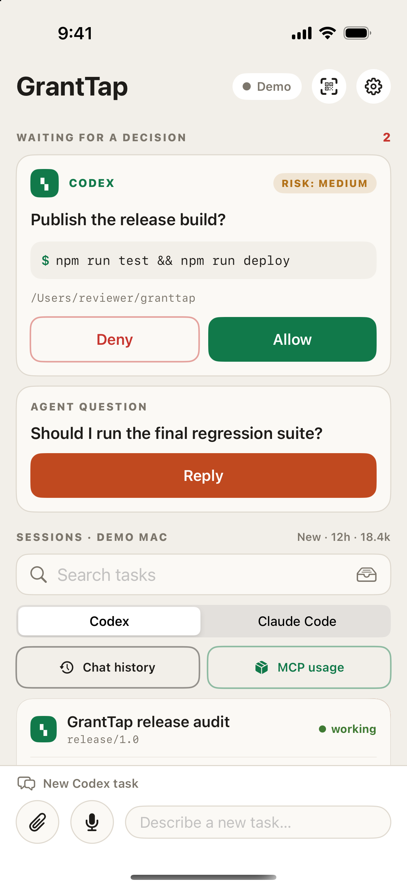
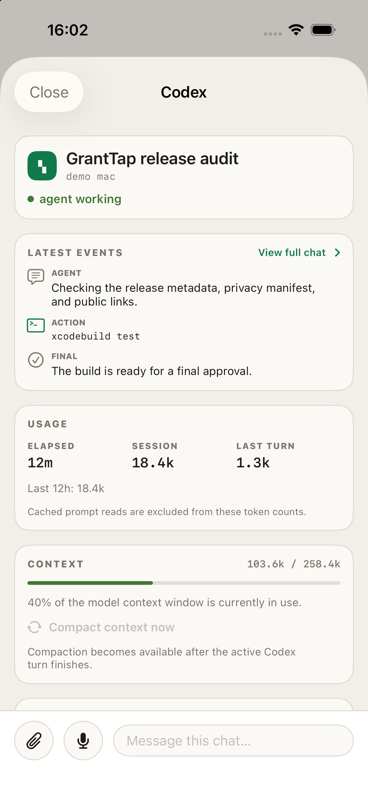
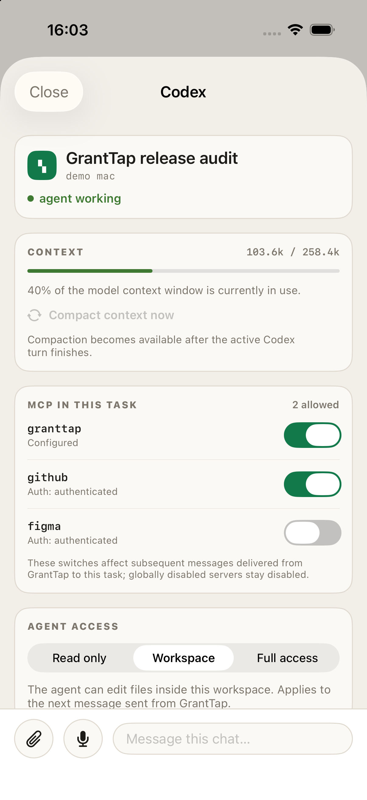
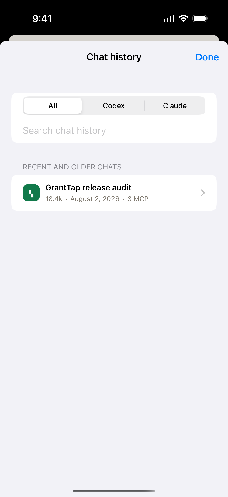
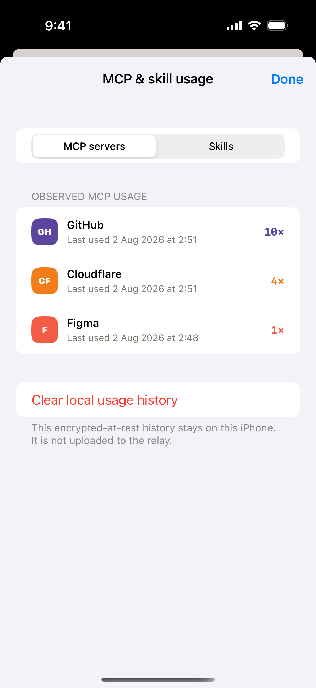

# GrantTap website

Source for [granttap.com](https://granttap.com), the product site for GrantTap
on iPhone and Apple Watch.

| Tasks on iPhone | Context usage | Per-task MCP | Approval on Apple Watch |
| --- | --- | --- | --- |
|  |  |  |  |

| Chat history | MCP and skill usage |
| --- | --- |
|  |  |

The canonical product site explains the GrantTap workflow, security boundary,
MCP integration, phone/watch experience, and current App Store launch status
using real screenshots from the app. The product tour animates iPhone screen
changes, a scroll gesture, the Watch activity/approval transition, and the
decision toast. A live animated countdown tracks the App Store submission date;
`prefers-reduced-motion` visitors receive a static first frame.

The product copy also covers the protected on-device MCP/skill usage ledger and
the bounded old-chat browser with per-chat tokens, context, MCP, skills, and
local archive controls. MCP branding comes from each server's actual
`serverInfo` metadata; the site does not claim inferred provider logos.
English is the default; visitors can switch the full site to Russian.

The capability copy also covers GrantTap's native recurrence editor and its
real E2EE conversational scheduler planner for local Codex and Claude Code.

## Install the public MCP bridge

```bash
# Codex
codex mcp add granttap -- npx -y granttap-mcp

# Claude Code
claude mcp add granttap -- npx -y granttap-mcp

# Optional approval hooks for both tools
npm install -g granttap-mcp
granttap-mcp connect
```

- npm: [granttap-mcp](https://www.npmjs.com/package/granttap-mcp)
- Source: [sergii-ziborov/granttap-mcp](https://github.com/sergii-ziborov/granttap-mcp)
- Relay source: [sergii-ziborov/granttap-relay](https://github.com/sergii-ziborov/granttap-relay)

## Development

Requires Node.js 22.13 or newer.

```bash
git clone https://github.com/sergii-ziborov/granttap-site.git
cd granttap-site
npm install
npm run dev
```

Validate the production build with:

```bash
npm test
npm run lint
```

The app is built with React, vinext, and Cloudflare's Vite tooling. The
production Worker is configured by `wrangler.production.jsonc` and deployed
directly to the `granttap.com` custom domain:

```bash
npm run deploy:cloudflare
```

`granttap.com` is the only canonical origin. The former hosted service URL and
`www` are permanent redirects, so search engines see one site rather than
duplicate content.

## Content and assets

- Page content: `app/page.tsx`
- Global styles: `app/globals.css`
- Metadata: `app/layout.tsx`
- Product screenshots: `public/product/`
- Social preview: `public/og.png`
- Privacy: `app/privacy/`
- Terms: `app/terms/`
- Support: `app/support/`
- Licenses: `app/licenses/`
- Security policy: `SECURITY.md`

## Related

- MCP bridge: [sergii-ziborov/granttap-mcp](https://github.com/sergii-ziborov/granttap-mcp)
- npm package: [granttap-mcp](https://www.npmjs.com/package/granttap-mcp)
- Relay: [sergii-ziborov/granttap-relay](https://github.com/sergii-ziborov/granttap-relay)
- Support: [granttap.com/support](https://granttap.com/support)

GrantTap is not affiliated with Anthropic, OpenAI, or Apple.
