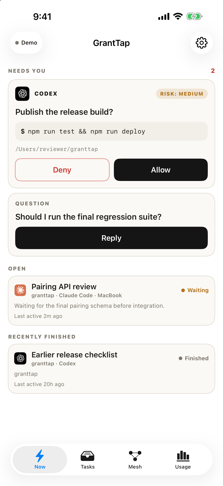
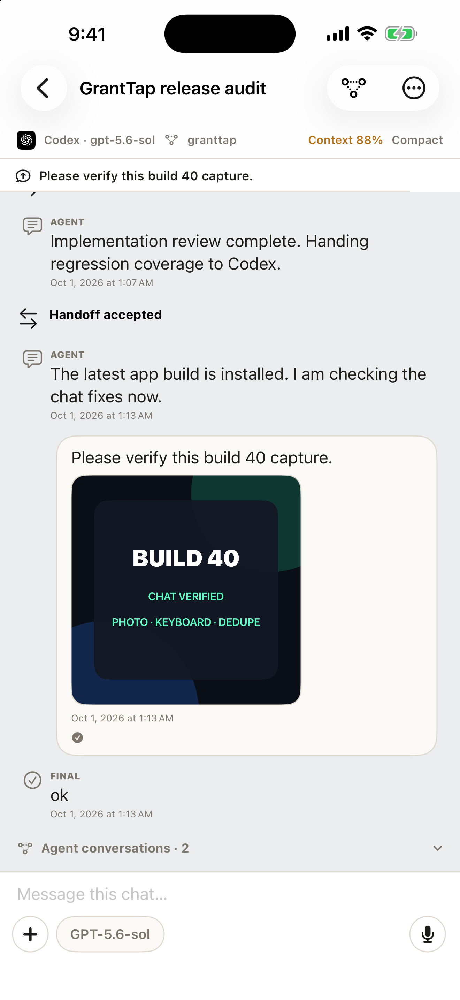

# GrantTap Personal website

The publicly readable website source is under the
[GrantTap Commercial Source License](LICENSE). Production deployment and
redistribution of versions under this license require a commercial grant.
Copies released earlier under MIT retain their original MIT permissions.

GrantTap is a Personal live control center for local coding agents:

> See what your coding agents are doing. Step in when they need you.

The public site presents one product across Mac, iPhone, iPad, and Apple Watch with Claude
Code, Codex, Cursor Beta, and Grok Build where its implemented behavior is
available. The site presents one Personal product.

The current home-page phone captures were retaken on 2026-10-01 from the
deterministic iPhone simulator demo: Now, Tasks, dated Task chat, Usage, and
the Mesh/Repositories switch. They depict sample work, not a customer's
session or a live repository scan. Older feature captures remain identified as
fixtures below; the home gallery does not imply that an agent authored the
architecture graph or measured its own resource use.

Mesh coordinates those existing agents with bounded encrypted task
state, dependencies, resource claims, agent-to-agent questions, and same-task
handoffs across computers. Mesh Governance decides, per Mesh, which
skills, MCP servers, and shell access agents may use, and every linked computer
reports whether the policy was applied. It does not copy hidden reasoning or turn GrantTap
into a coding agent or an unrestricted orchestrator.

Company accounts and Mesh members are separate. On the owner's phone,
an account receives selected or all repository IDs. A phone or tablet can pair
to the account with a one-time code even before any computer or Mesh exists;
this grants no Mesh access. The owner later selects Mesh spaces and a role for
that device. A Mesh invitation does not change Git provider ACLs.
The owner phone checks both before forwarding Mesh data and actions.

## Install

```bash
# Codex plugin
codex plugin marketplace add sergii-ziborov/granttap-mcp
codex plugin add granttap@granttap

# Claude Code plugin
claude plugin marketplace add sergii-ziborov/granttap-mcp
claude plugin install granttap@granttap

# Background helper and provider hooks
npm install -g granttap-mcp
granttap setup
```

After plugin installation, run `granttap setup` and open
[granttap.com/connect](https://granttap.com/connect) on the Mac for coding-app
approval and observations. The GrantTap connection card in the coding app offers **Add a device**,
**Add another device**, and **Reconnect**. Codex Connected accounts is
unrelated to GrantTap device pairing. Scan in the GrantTap app when a device
joins. An existing trusted iPhone or iPad
can show an expiring QR in Settings to add another controller to its linked
computers; this joins the device network rather than a Mesh. Do not ask an
agent to print a pairing QR in chat. The plugin and local `granttap-mcp`
runtime must use compatible protocol versions.

An optional GrantTap account passkey signs in on Mac or iPhone. On a Mac with
the local bridge, `/connect` can use a fresh passkey assertion to approve a
coding app. The phone-to-computer pairing key still moves through a separate
encrypted device-link flow; signing in alone does not recover an old phone
connection. QR pairing remains available without any account.

Live `/`, `/connect`, and `/api/connect` use the Hetzner compose stack.
The connect page does not generate or display a pairing QR.

For Cursor, install the reviewed **GrantTap** Marketplace listing, then
`granttap setup`. Do not add GrantTap in Customize → MCPs.

The Task screenshot includes a demo Runtime history. On a real computer,
Invocation history requires the separately distributed GrantTap Engine. A tool
request or reported success is not presented as a verified filesystem change;
the bridge does not yet produce verified change events or revision-bound impact
links.

- [granttap-mcp source](https://github.com/sergii-ziborov/granttap-mcp)
- [npm package](https://www.npmjs.com/package/granttap-mcp)
- [ciphertext relay source](https://github.com/sergii-ziborov/granttap-relay)

## Public customer pages

- [About](https://granttap.com/about)
- [Journal](https://granttap.com/blog): EN/RU guides and five new editorial stories with clearly labelled
  deterministic product captures and five generated editorial illustrations.

The new stories are dated October 3, 10, 17, 24, and 31, 2026. The blog routes
and dynamic sitemap release each story at midnight in Asia/Jerusalem; unpublished
stories return 404. The comparison article states its October 3 source-check date.
- [Pricing](https://granttap.com/pricing)
- [Privacy](https://granttap.com/privacy)
- [Terms](https://granttap.com/terms)
- [Support](https://granttap.com/support)
- [Security](https://granttap.com/security)
- [Data choices](https://granttap.com/data-rights)
- [Accessibility](https://granttap.com/accessibility)
- [Licenses](https://granttap.com/licenses)

## Development

Node.js 22.13 or newer is required.

```bash
npm install
npm run typecheck
npm test
npm run lint
```

Live granttap.com is the Hetzner compose stack: `/` on port 3211, `/connect`,
`/api/connect`, and `/api/account` on port 3210. Passkey account records live
in the persistent `account_data` volume; deploys must retain that volume and
install the matching `hetzner/nginx.conf` account route. `wrangler.production.jsonc` is a leftover
Cloudflare config — do not `wrangler deploy` it over the live domain. Publish
by rsyncing this tree to `/srv/apps/granttap-site/releases/` and
`podman compose -p granttap-web -f compose.hetzner.yaml up -d --build`.

Product captures under `public/product/` must come from deterministic sample
data and contain no real pairing, task, repository, credential, or audit data.
`iphone-company-accounts.png` and `iphone-company-repositories.png` are iPhone
Simulator captures from the owner-managed account and repository grant screens.
`iphone-linked-projects.png` is an older iPhone Simulator Debug demo capture from
internal source `1aecdca`. It shows binding-level grouping and the corrected
device-scoped invite copy; it does not claim a Weavatrix dependency was observed.
`iphone-weavatrix-graph.png` and `iphone-health-code-towers.png` are kept UI-test
attachments from deterministic architecture and code-map fixtures. Their
`demo-revision` label is deliberate; neither depicts a live repository scan.
The updated `iphone-command-center.png`, `iphone-tasks.png`, `iphone-chat.png`,
`iphone-mcp-usage.png`, and `iphone-project-mesh.png` are current iPhone
Simulator captures. The chat capture was refreshed on 2026-10-03 to show the
user's last request above the timeline. The site references them with a versioned URL to
invalidate browser caches after deployment.

## Current captures

<p align="center">
  
  
  
</p>

## Mac commerce

The Mac client source is public in [granttap](https://github.com/sergii-ziborov/granttap),
including its [Mac end-user license](https://github.com/sergii-ziborov/granttap/blob/main/apps/macos/DESKTOP_EULA.md).
The proposed one-time Mac License is USD 39.99, with optional existing Personal
tiers. Until App Store approval, this is preparation rather than availability.
Direct address discovery and the licensed personal/internal own-relay mode
require no Personal subscription. Supply a reachable TLS endpoint or VPN;
announcing an IP does not open NAT, configure TLS or promise background APNs.

Mac menu and device-network support is documented on `/support`; the Apple app
bundles the same English/Russian customer documents for offline access. Current
production uses Podman. Deploy only the `site` service for copy changes so pairing
and `/api/connect` remain on the existing `web` service.
